# Elementary_Finite_Element_Analysis

Hello there! If you are learning FEM from ground zero this is a great place for you to start. This is a repository of MATLAB codes that contains some popular FEM problems one usually encounters when learning FEA for the first time. This repository includes beginner-friendly and readable codes (with adequate comments) for some elementary FEM problems. As one would normally encounter in any FEM course, I have included FEM for the 1D Truss,2D Truss,3D Truss , 2D Plates (plane stress condition), Plate with a Hole and some 3D Geometries and finally the results are compared with ANSYS Structural (APDL). Since this is absolutely elementary, I have considered all problems as Linear . Though, it might be a great idea to include a fast iterative solvers and new FEM schemes . It shall soon be added, stay tuned! For details on which code to refer for a specific problem, read on further below:

# Finite Difference Method- 1D Truss
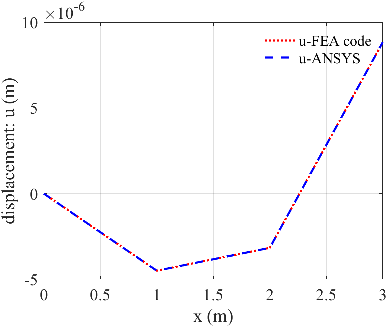

# Finite Difference Method- 2D Truss
## Example 1

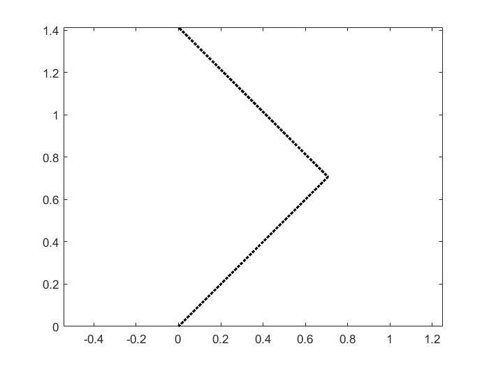
 
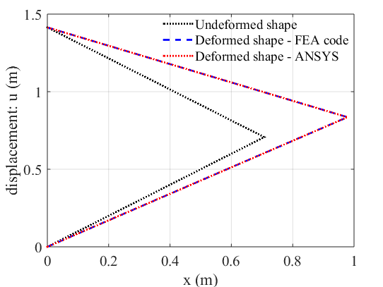

## Example 2

 

# Finite Element Method- 2D Plate
## Example 1
### 2D Mesh

### Results

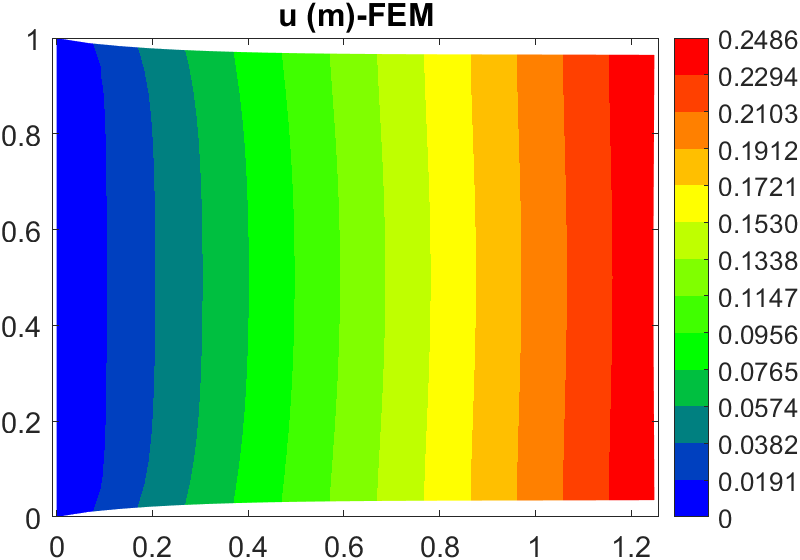
## Example 2
### 2D Mesh
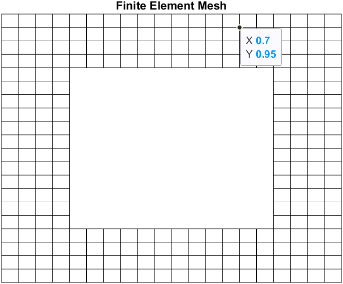

### Results
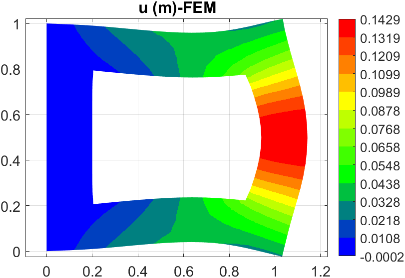

# # Finite Element Method- 3D cantilever 
Using FEM on a 3-D structured mesh . The results look something like 
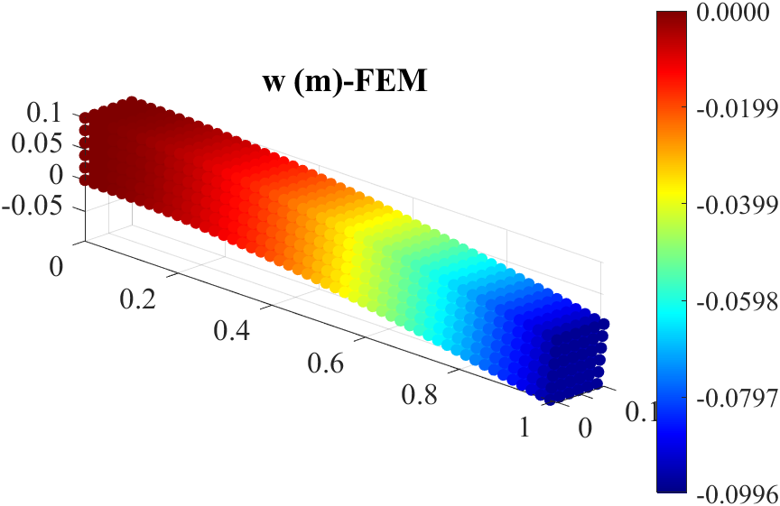

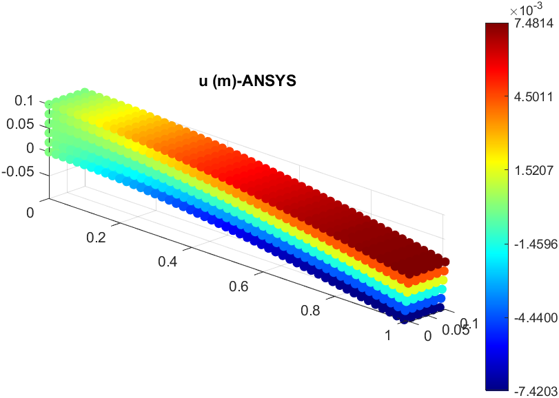

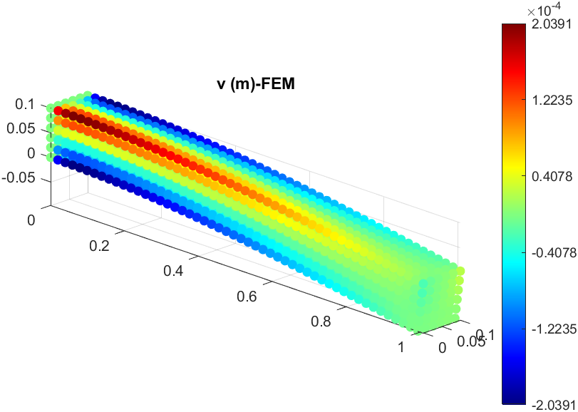

### Von Mises Stress
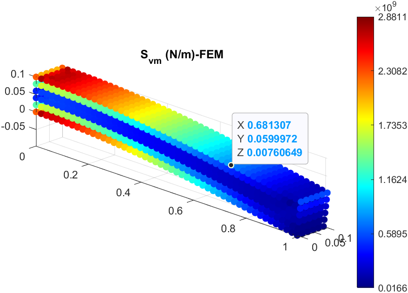
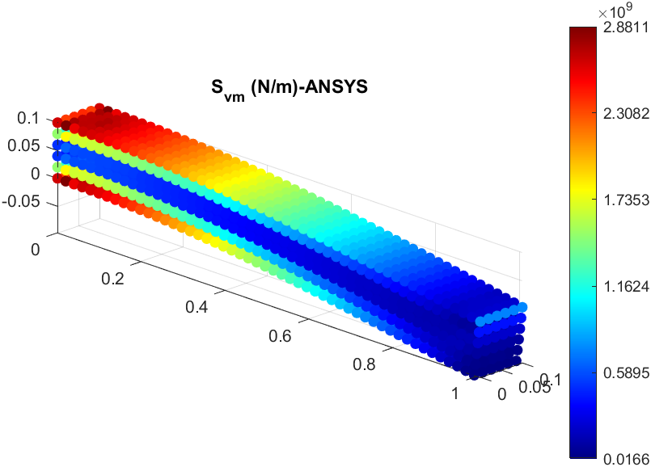
